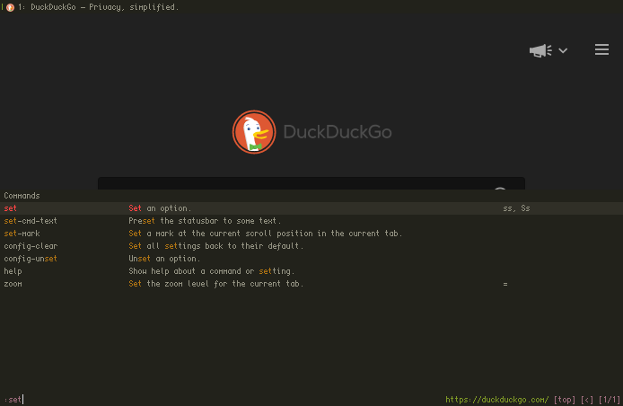

### [qutebrowser](https://www.qutebrowser.org/) [atelier](https://atelierbram.github.io/syntax-highlighting/atelier-schemes/) colorschemes



#### Install using Git

If you are a git user, you can install the theme and keep up to date by cloning the repo:

    $ git clone https://github.com/00x29a/atelier-qutebrowser.git atelier

#### Install manually

Download using the [GitHub .zip download](https://github.com/00x29a/atelier-qutebrowser.git) option and unzip.

#### Activating theme

- Find your *[qutebrowser configuration directory](https://www.qutebrowser.org/doc/help/configuring.html#configpy)* (see e.g. `:version` in qutebrowser). This folder should be located at the "config" location listed on qute://version, which is typically ~/.config/qutebrowser/ on Linux, ~/.qutebrowser/ on macOS, and %APPDATA%/qutebrowser/config/ on Windows.
- Move the repository folder to `atelier` inside the configuration directory.
- In your [qutebrowser config.py file](https://www.qutebrowser.org/doc/help/configuring.html#configpy), include the following:

```python
import atelier.draw

# Load existing settings made via :set
config.load_autoconfig()

atelier.draw.estuary(c, {
    'spacing': {
        'vertical': 2,
        'horizontal': 2
    }
})
```
